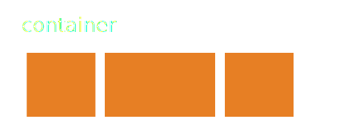
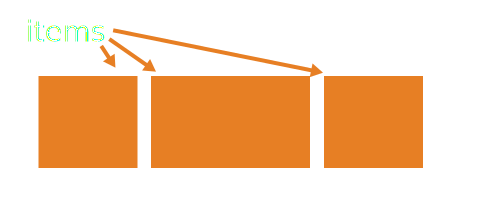

# FEWD 23 Lesson 15

## Responsive and fun layouts

---

## Agenda

* Responsive Review
* Flexbox

Note:
Everyone needs to update GitHub class repo!

---

## Fixed Layout

* Used up to this point
* Relies on a container of fixed width
* Usually 960px or 1024px (but not always)

Examples:

* [DanNavarro.com](http://www.dannavarro.com/)
* [EddieFromOhio.com](http://www.eddiefromohio.com/)

---

## Responsive Layout

* Different styles for different screen widths
* Uses an elastic/fluid layout
* Sized in percentages or ems

Examples:

* [Boston.com](http://www.boston.com)
* [Etsy.com](https://www.etsy.com/)

---

## EM vs. REM

* Sized based on the width of the letter “m” 
* 1em = 100% font-size of its parent
* 1rem = 100% font-size of body

---

## Media Query Review

---

## Media Queries

```
@media only screen and
```

* (max-width: xPx)
* (min-width: xPx)
* (max-device-width:xPx)
* (min-device-width:xPx)

Separate multiple clauses with “and”

---

## Mobile Display

```
<meta name="viewport" content="width=device-width, initial-scale=1">
```

---

## Standard media queries sizes

* Small: up to 768px
* Medium: 768-991px
* Large: 992px+

---

## Responsive: Step 1

* Convert widths to percentages
* Size fonts in ems
* Identify columns that can be stacked

---

## Responsive: Step Two

* Determine what content is extra
    * Does that h1 need an h2 under it?
    * Will that one-liner get the visitor to understand my site or is it extra?

* Determine what content needs to be visible
    * Is it necessary to show my entire nav if there are other ways of getting to navigation?

---


## Startup Matchmaker

---

## Flexbox

* Set of CSS properties 

* Provides a more efficient way to layout and align items in a container.

* Great for when the items' sizes are unknown or could change.

Note:
https://css-tricks.com/snippets/css/a-guide-to-flexbox/

---

## Flexbox





---

## Flexbox

* Give the container the ability to alter the order of its items to automatically fill available space.

* Accommodates all kind of display devices and screen sizes.

* Container expands items to fill available space or shinks them to prevent overflow.

---

## CSS for Flexbox

To use Flexbox, you need to add CSS styles to both the __containers__ and its __items__.

---

## HTML setup

```
<section class="container">
    <div class="item">Item 1</div>
    <div class="item">Item 2</div>
    <div class="item">Item 3</div>
</section>
```

Note:
Write code live while explaining the CSS properties coming up.

---

## CSS for Flexbox Containers

To use the flexbox layout, the container must have a display of 'flex'

```
.container {
    display: flex;
}
```

---

## Flex Direction

Determines the direction that the items are displayed in

Property for the container.

```
.container {
    display: flex;
    flex-direction: row | row-reverse | column | column-reverse;
}
```

__row__ is the default.

---

## Flex Wrap

Determines whether or not the container will allow items to wrap.

Property for the container.

```
.container {
    display: flex;
    flex-direction: row;
    flex-wrap: wrap | nowrap;
}
```

__nowrap__ is the default.

---

## Justify Content

Aligns the items inside the container

Property for the container.

```
.container {
    display: flex;
    flex-direction: row;
    justify-content: flex-start | flex-end | center | space-between | space-around;
}
```

---

## Flex Basis 

Determines the default size of an item.

Property for the item.

```
.item {
    flex-basis: 20%;  /* can be any length */
}
```

---


## Baby Animals

---

## Upcoming due dates!

* Next Tuesday
    * Next final project milestone - JS rough draft!
