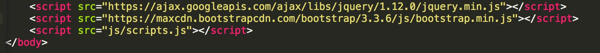

# FEWD 23 Lesson 16
## Flexbox

---

## Agenda

* Responsive Review
* Flexbox

---

## Responsive Review

Note:
Go through Startup Matchmaker from Tuesday... just a couple parts.

---

## Flexbox

* Set of CSS properties 

* Provides a more efficient way to layout and align items in a container.

* Great for when the items' sizes are unknown or could change.

Note:
https://css-tricks.com/snippets/css/a-guide-to-flexbox/

---

## Flexbox


---

## Flexbox

* Give the container the ability to alter the order of its items to automatically fill available space.

* Accommodates all kind of display devices and screen sizes.

* Container expands items to fill available space or shinks them to prevent overflow.

---

## CSS for Flexbox

To use Flexbox, you need to add CSS styles to both the __containers__ and its __items__.

---

## HTML setup

```
<section class="container">
    <div class="item">Item 1</div>
    <div class="item">Item 2</div>
    <div class="item">Item 3</div>
</section>
```

Note:
Write code live while explaining the CSS properties coming up.

---

## CSS for Flexbox Containers

To use the flexbox layout, the container must have a display of 'flex'

```
.container {
    display: flex;
}
```

---

## Flex Direction

Determines the direction that the items are displayed in

Property for the container.

```
.container {
    display: flex;
    flex-direction: row | row-reverse | column | column-reverse;
}
```

__row__ is the default.

---

## Flex Wrap

Determines whether or not the container will allow items to wrap.

Property for the container.

```
.container {
    display: flex;
    flex-direction: row;
    flex-wrap: wrap | nowrap;
}
```

__nowrap__ is the default.

---

## Justify Content

Aligns the items inside the container

Property for the container.

```
.container {
    display: flex;
    flex-direction: row;
    justify-content: flex-start | flex-end | center | space-between | space-around;
}
```

---

## Flex Basis 

Determines the default size of an item.

Property for the item.

```
.item {
    flex-basis: 20%;  /* can be any length */
}
```

---


## Baby Animals

Note:
Code is in lesson 15 folder.

---

## Bootstrap

---

## The parts of Bootstrap

* CSS (grid)
* Components (CSS-things, more complicated)
* Javascript (interactive things)

---

## Bootstrap Javascript things

* Bootstrap includes both CSS and Javascript pieces.
* Javascript pieces require jQuery, which you need to load separately.

---

## Order of JS files

1. jQuery
2. Bootstrap
3. Your JS file



---

## Bootstrap Popovers

http://getbootstrap.com/javascript/#popovers

